
            

 
 
# JLC Jonathan Lechien 
### jlechien@he2b.be 
### 

 
# MHI Mohamed Hadjili
### mhadjili@he2b.be
### 

 

 
# ABE Abderrahmen Belfikh
### abelfkih@he2b.be
### 

 

> **Contact des membres du personnel**: https://ects.esi-bru.be/online/personnels/ac2526.html
---

# Objectifs et acquis d'apprentissage

- Introduire les étudiant·e·s aux divers domaines et rôles de l'informatique

- Identifier et nommer les différents domaines de l'informatique

- Expliquer les métiers et les rôles spécifiques associés à un diplôme en informatique

- Établir des liens entre les compétences acquises pendant le programme d'études et les chemins de carrière correspondants

> **Fiche de l'activité**: https://ects.esi-bru.be/online/cours/ac2526_1int1a_1intm1a.html

<!--
Cette activité vise à introduire les étudiant·e·s aux différents domaines de l'informatique, tels que le développement logiciel, les bases de données, les réseaux, ... Elle présente les métiers et rôles associés à un diplôme en informatique, détaillant leurs responsabilités, compétences nécessaires et opportunités professionnelles. L'objectif est d'aider les étudiant·e·s à établir des liens entre leurs compétences et les carrières possibles, en les encourageant à réfléchir à leurs intérêts pour identifier des chemins professionnels pertinents. Ce cours fournira une mise à jour sur les tendances actuelles et émergentes du secteur de l'informatique.
-->

---        

# Moments clés

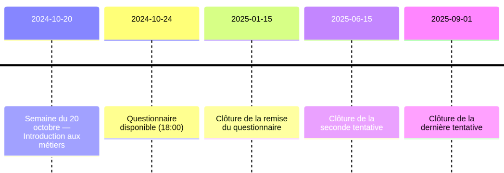

> **Supports**: https://poesi.esi-bru.be/

<!--
Le cours se déroule comme suit : 
- Aujourd'hui nous allons passer 3 à 4H ensemble pour présenter les métiers associés aux trois sections de l'ESI.
- Après la semaine des bilans, au mois de novembre vous aller recevoir un questionnaire à remplir concernant les métiers liés à l'informatique. Je vous expliquerai les détails de ce formulaire en fin de cette séance. Ce formulaire est à remplir en ligne et à soumettre lors de la session de janvier

Vous trouverez le support de la présentation d'aujourd'hui sur PoEsi. C'est aussi via PoEsi que vous recevrez le questionnaire en novembre. Pour connaître l'horaire de la séance en novembre, consultez le site horaires.esi-bru.be

> **Horaire**: https://horaires.esi-bru.be/

-->

---        
     

<!-- _class: transition2 -->  

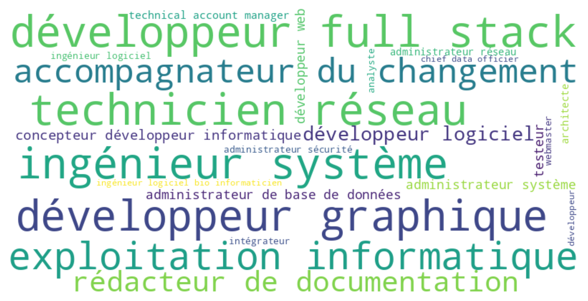
 
<!--
Si je consulte une liste des métiers de l’informatique, comme la page les métiers de l'informatique de Wikipedia (https://fr.wikipedia.org/wiki/Cat%C3%A9gorie:M%C3%A9tier_de_l%27informatique) voici des exemples de ce que je peux y trouver.

Parmi ces métiers on trouve des noms comme "Développeur", "technicien réseau" ou encore "administrateur sécurité". On peut se faire une idée approximative des tâches que les personnes ayant ces métiers effectuent. Par contre il est sans doute plus compliqué de savoir ce que fait un "intégrateur" ou encore un "architecte" (dans le cadre de l'informatique ;)).

L'objectif de la séance d'aujourd'hui est de dévoiler les tâches et les responsabilités de certains métiers et d'associer ces métiers avec les enseignements de votre formation.

-->

---           
# Recherche d'emploi : offres généralistes

### Exemples : 

- **Actiris** : https://www.actiris.brussels/fr
- **Stepstone** : https://www.stepstone.be/fr
- **Indeed** : https://emplois.be.indeed.com

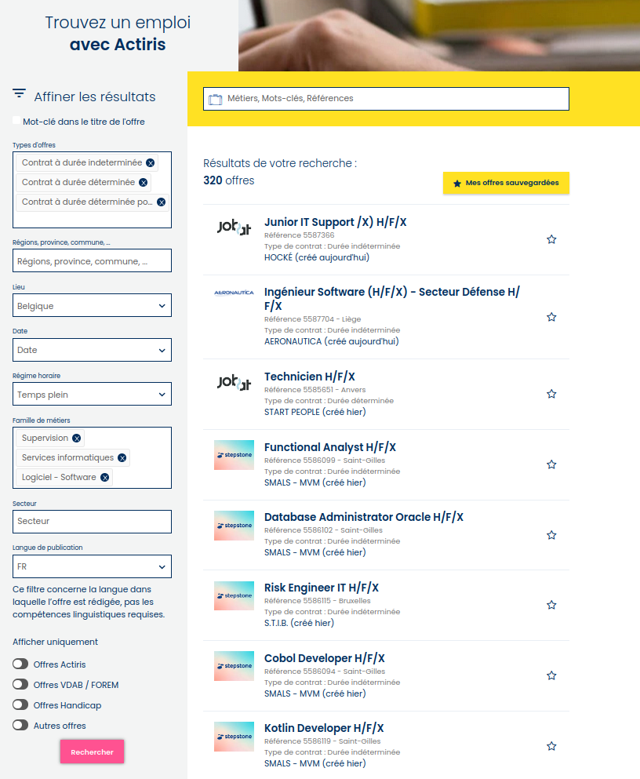

<!--
Pour ancrer cette présentation dans le réel, je vais illustrer les métiers choisis via des offres d'emploi actuelle.

Un des fournisseur d'offre d'emploi que je vais utiliser est Actiris. Il s'agit de l'agence régionale pour l'emploi en Région de Bruxelles-Capitale. Il s'adresse principalement aux résidents de la région bruxelloise à la recherche d'emploi, y compris les informaticiens. Actiris propose des offres d'emploi dans divers secteurs, y compris l'informatique, mais il couvre un large éventail de professions.

Comme on vous pouvez le voir sur cette image, une recherche par mots-clés, localisation, type de contrat, etc est disponible. Si on souhaite se focaliser uniquement sur les métiers de l'informatique le champs "Famille de métiers" permet de sélectionner uniquement les métiers de l'informatique. Des filtres spécifiques sont proposés comme Supervision, Services informatiques, Logiciel ou Matériel.

On peut déjà voir apparaitre les métiers de développeur, de Security Officer, de Data Analyst apparaître dans cette première recherche. En naviguant plus profondément dans la recherche, on appaercoit IT Support, Quality, DEVOPS, Cloud,...

-->

---        
     
# Recherche d'emploi : offres spécialisées

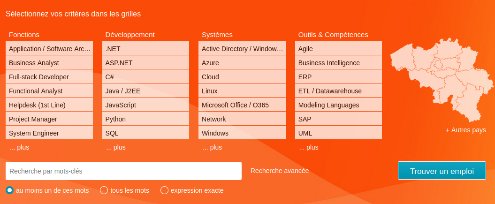

> **ICT Job**: https://www.ictjob.be/fr/

<!--
Si on souhaite se demander comment organiser les recherches d'emploi en informatique, on peut se diriger vers un second fournisseur d'offre d'emploi comme ICTjobs. ICTjobs.be se concentre exclusivement sur les emplois liés à l'informatique et aux technologies de l'information. Vous y trouverez des offres d'emploi spécifiquement adaptées aux professionnels de l'IT.

Les filtres de recherche sont tout de suite plus adaptés.

Arrêtons-nous un instant sur les filtres par défaut : 
- les fonctions permettent de mettre en avant diverses professions comme celle de Business analyst, de consultant, d'analyste programmeur, d'analyste fonctionnel, d'informaticien support, de project manager et d'administrteur système.

Nous allons aborder ces métiers durant la présentation. Mais on peut déjà mettre en avant que les personnes exercant ces métiers interviennent à des moments différents de la vie d'un logiciel informatique. 

- Ensuite on peut caractériser une offre d'emploi informatique par son language de développement. Vous en connaissez sans doute peut-être de nom, comme le Java ou le Javascript. Mais en résumé un langage informatique est un ensemble de règles et de conventions permettant à un être humain de communiquer des instructions à un ordinateur pour qu'il exécute des tâches spécifiques. Lorsque l'on est informaticien, une fois les bases de différents langages appris, on peut souvent en apprendre rapidement de nouveau. Même si on a tendance à se spécialiser dans certains langages en particulier. D'où le filtre présent ici.

- La troisième colonne est celle des systèmes. Si le langage permet de donner des instructions à une machine, le système  gère les ressources matérielles d'un ordinateur, fournissant un environnement permettant l'exécution de programmes, la gestion des fichiers et l'interaction avec l'utilisateur. De la même façon que pour les langages, un informaticien doit être polyvalent en terme de systèmes, même si on se spécialise souvent.

Finalement vous pouvez lire les filtres "outils et compétences". Ce scompétences comme l'Agile permettent de décrire des outils ou des méthodologie de travail que doit connaitre un informaticien.

On peut cliquer sur plus... pour présenter l'arbre des techniques aux étudiants.

Finalement vous voyez comment on peut trier les métiers de l'informatique. Via leur place dans le cycle de vie d'un logiciel, via les langages ou les systèmes utilisés ou encore via les outils qu'il met en oeuvre.

-->

---
# Scénarios et profils

### Suivi de 3 informaticien·nes : 

- **Alice** commence sa carrière en tant que **développeuse junior**
- **Bob** se voit confier des responsabilités liées à la **gestion des réseaux**
- **Carole** est engagée comme **gestionnaire IoT**

<!--
Afin de rendre digeste une telle quantité d'information, nous allons parcourir ensemble le parcours de 3 informaticiens : 
- Alice, junior développeuse qui débute en informatique
- Bob architecte réseau qui a déjà un peu d'expérience
- Carole gestionnaire IoT (Internet of things - Objects connectés) qui a également un peu d'expérience

Ces 3 personnes ont chacunes suivis une des trois formations dispensées au sein de l'ESI : 
- Développement d'application
- Réseaux et télécommunication
- Informatique industrielle
-->

---        
     
# Les personnages

<figcaption align="center">
<b>Extrait</b> de la page wikipédia <em>Alice et Bob</em>.
</figcaption>

## Culture informatique
 
Les personnages Alice et Bob sont des figures classiques en cryptologie. Ces noms sont utilisés au lieu de « personne A » et « personne B ».

- *A* : Alice
- *B* : Bob
- *C* : Carole
- *D* : David
- ...

<!--
Pour information les noms donnés à ces trois informaticiens viennent d'une habitude provenant de la cryptographie. Au lieu de parler en terme de perosnne A, B, C,... des prénoms ont été associés par défaut à chacune des lettres. Vous pouvez retrouver quelques exemples sur la page wikipédia de  https://fr.wikipedia.org/wiki/Alice_et_Bob
-->

 ---         
<!-- _class: transition2 -->  

 Première partie  **Le développement d'applications**

---        
     
# Le premier client d'Alice

### Alice est assignée à un projet pour un cinéma local

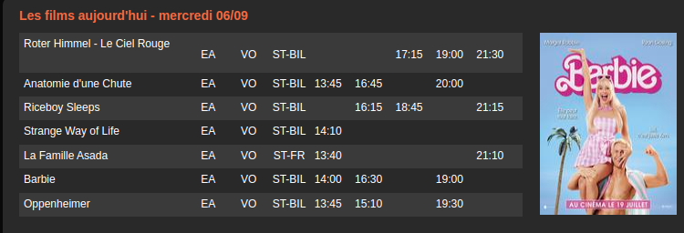

<figcaption align="center">
<b>Figure</b>: Interface graphique demandée.
</figcaption>

### Demandes des utilisateurs
 
- **Consultation des horaires** : Pouvoir consulter la programmation complète des films et des horaires disponibles. Ils doivent avoir accès aux informations telles que les dates de sortie, les genres, les acteurs, et les évaluations.

<!--

Alice, notre analyste développeuse junior, est assignée à un projet pour un cinéma local. Le travail d'analyste développeur commence toujours par une demande : un utilisateur souhaite un logiciel. Pour Alice, son utilisateur demande de pouvoir consulter la programmation complète des films et des horaires disponibles du cinéma via une interface web. Les clients du cinéma doivent avoir accès aux informations telles que les dates de sortie, les genres, les acteurs, et les évaluations. Pour l'aider à réaliser cette demande l'utilisateur fournit en détail l'interface graphique qu'il imagine.

Souvent en informatique pour ce type de demande, on divise le travail en différentes étapes chacune associée à un métier précis. Si la demande prend peu de temps à être réalisée, une personne effectue l'ensemble des tâches, mais dans le cadre de cette présentation je vais exagérer les faits et détailler le métier caché derrière chaque étape.

-->

---
# Division du travail

## Tâches      
<!-- _class: cool-list -->

1. *Interroger les utilisateurs*
2. *Développer l'interface graphique*
3. *Développer la logique*

  

   

## Métiers

4. *Analyste* 
5. *Développeur·se front-end* 
6. *Développeur·se back-end* 
 

    

        

<!--
Avant de se lancer dans la réalisation du logiciel demandé, elle doit commencer par interroger l'utilisateur sur ce qu'il souhaite exactement. Par exemple, elle doit s'assurer que l'utilisateur n'a rien oublié dans sa demande : 
- à quel horizon peut-on consulter les horaires ?
- peut-on consulter les séances des jours passés ? Jusqu'à qu'elle échéance ?
- d'où proviennent les données concernant ces séances ? Faut-il créer cette source de données ou est-elle déjà disponible ?
- l'utilisateur souhaite-il qu'on puisse réserver les séances ?
- que se passe-t-il si une séance est annullée ? comment est modifié l'affichage ?
- le site doit-il être accessible sur n'importe quel apvant de commencer à réaliser le logiciel il faut comprendre de quoi il est composé et estimer combien de temps ça va prendre, et combien ça va couter.

Cette première étape est appelée analyse et est réalisée par un ou une ... analyste.

Lorsque la description des beoins est claires, on peut se lancer dans le développement. Mais là encore Alice est doit organiser son travail. Par quoi commence-t-elle ?

Une division classique du travail est la séparation entre la partie du logiciel qui affiche les informations et la partie qui traite les informations. C'est la séparation du Frontend et du Backend. Classiquement ces deux parties sont distribuées à des métiers différents, intitulés développeur Frontend et développeur backend.
-->

---
# Développeur·se Frontend

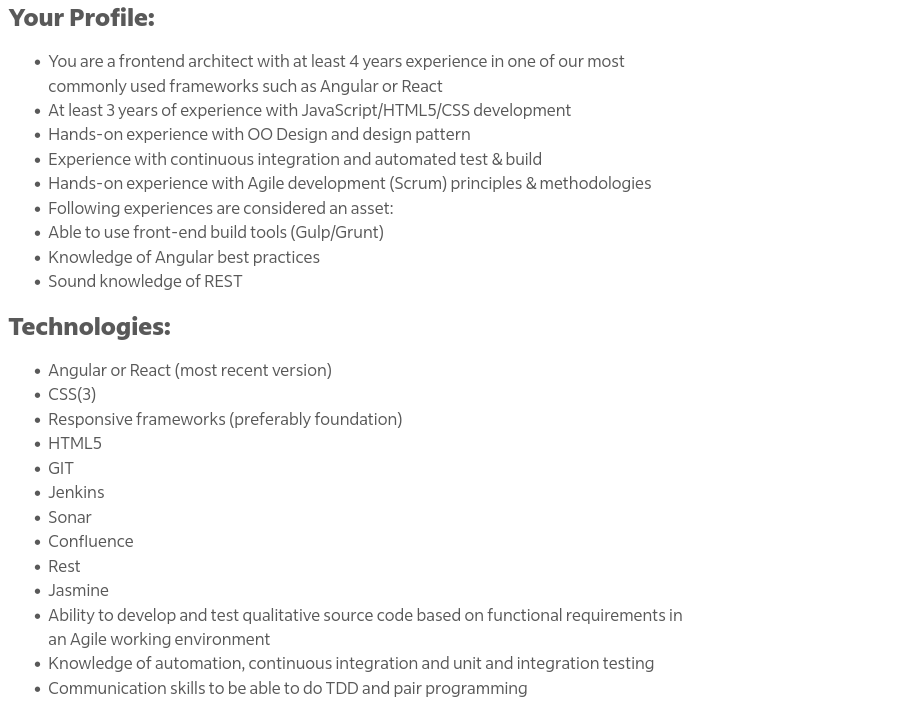

  

   

## Zoom sur le vocabulaire

- Javascript/HTML/CSS, Angular
- Git, Sonarqube, Jenkins
- OO Design pattern
- Méthodologie Agile
- Integration continue, tests unitaires
- Service Rest
- **Communication** et travaille en **équipe**

    

   

> https://emplois.be.indeed.com/viewjob?jk=0e323628ad225c1a&from=shareddesktop_copy consulté le 27/09/2025

<!--
Afin d'illustrer les compétences attendues de la part d'un développeur frontend, voici une offre d'emploi consultée cette semaine. Pour information cette offre n'a pas été totalement prise au hasard, dans le sens où elle explicite les technologies requises, ce que toutes les offres ne font pas toujours, mais n'est pas là pour mettre en avant une entreprise en particulier.

Le but est que vous puissiez associer les compétences associées à un développeur frontend et constater que ces compétences sont "étrangement" présentes dans les cours dispensés à l'ESI.

<On peut cliquer sur le lien de l'offre pour la parcourir.
Il faudrait mettre sur PoEsi un backup de l'offre au cas où elle cloturée>

Cette offre permet de voir quelques technologies liées au développement frontend : NodeJS, Angular, React and React Native. En résumé la partie frontend d'une application web est composée d'HTML, de CSS et de Javascript. Le rôle de ces technologies sera détaillé dans les cours de Web, mais en résumé HTML (HyperText Markup Language) est utilisé pour structurer le contenu et les éléments d'une page web, CSS (Cascading Style Sheets) sert à définir la mise en page, tandis que JavaScript permet d'ajouter de l'interaction.
Un informaticien doit connaitre par défaut ces technologies, mais on peut utiliser du javascript de manière avancée via ce qu'on appele des Frameworks. NodeJS, Angular, React and React Native sont des exemples de frameworks. Et cette offre demande qu'on connaisse ceux-ci.

On voit aussi la mention de Java, sur laquelle je reviendrai dans quelques minutes, lors de l'explication du métier de développeur backend.

Ensuite viennent des noms de technologies comme AWS que je laisse en suspens pour le moment.

Finalement l'offre d'emploi détaille les métiers avec qui un développeur frontend intéragit, il s'agit ici d'experts fonctionnels, qui sont les utilisateurs, d'UX designers, qui dessinent l'interface graphique, et de Scrum master. Ce dernier est une sorte de coordinateur du projet. On donne ce titre lorsque l'on travaille en suivant certaines méthodes dite agile. Vous le constatez sur une seule offre, un dictionnaire des mots clés de l'informtique est déjà nécessaire. Tous ces mots vous seront enseignés dans les cours appropriés. Par exemple la notion de Scrum Master est enseignée dans un cours de Gestion de projet et la notion d'expert fonctionnel dans un cours d'analyse.

-->

---        
# Front-end : Compétences et parcours étudiants

### Compétences techniques/Technicals skills

- HTML, CSS
- Language : Javascript
- Framework : Angular, React, Vue
- Conception

### Compétences générales/Soft Skills
 - Communication
 - Auto-apprentissage

### Unités d'enseignement
 - ALG[X]
 - WEB[X]
 - DEV[X]
 - IHM[X]
 - PRJ[X]
 

 > Note : https://he2b.be/wp-content/uploads/2024/04/DEV-2024.pdf

<!--
La lecture de cette première offre d'emploi me permet de vous construire cette petite fiche résumant les compétences d'un développeur frontend.

On y distingue ce qu'on appele les compétences techniques des compétences générales. Ces différentes compétences sont acquises à travers différents cours. On peut citer notamment les cours d'algorithmique, de développement web, de développement d'application bureautique, d'analyse ou encore de gestion de projet.

-->

---
# Développeur·se Backend

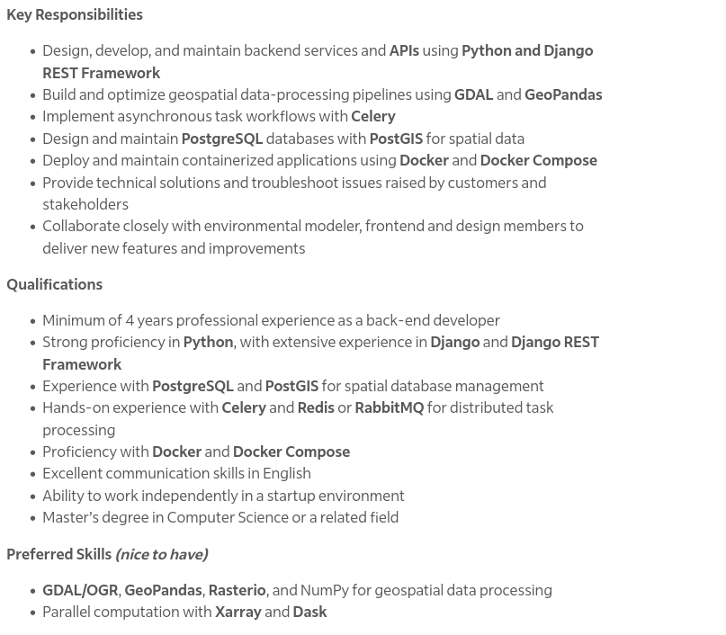

  

   

## Zoom sur le vocabulaire

- Expérience en développement backend **Django**
- Développement de **REST API**
- Connaissance de **PostgreSQL** 
- Connaissance de **Docker**
- Collaboration avec les **utilisateurs** et les développeurs **frontend**

    

   

> https://emplois.be.indeed.com/viewjob?jk=ebd8c0c381b64ee7&from=shareddesktop_copy consulté le 27/09/2025

<!--
Prenons un second exemple d'offre d'emploi avec cette fois un développeur backend. Son role est de développer la logique de l'application et sa gestion des données. HTML et CSS ne sont pas utiles au travail du développeur backend. Il doit maitriser des langages de programmations et des frameworks.  Pour cette offre il faut maitriser .NET Core. C'est un framework qui utilise le langage de programmation C#. C'est un framework de développement d'application web lié à Microsoft. Le dév backend est comme le dev frontend lié à une technologie. 

Dans les connaissances requises on constate aussi la mention de Rest Api. Des API vous en utiliser tous les jours sans vous en rendre compte. Expliquez grossièremen, c'est une manière de communiquer entre le programme backend et le programme frontend. Cette mention permet de se rendre compte que le dev backend même si il ne doit pas maitriser les technologies du frontend doit connaitre ce qui est attendu par ses collègues.

On trouve également des mentions comme "injections de dépendances". Ceci fait référence à une façon de programmer. A l'ESI vous allez apprendre des languages de progration pour vous permettre de donner des instructions à un ordinateur. Mais dans cet exercice, il y a des manières plus ou moins élégantes, plus ou moins pratiques de programmer. Les cours vous permettront d'apprendre ces techniques de progrmmation avancée.

Finalement en plus de la programmation, on demande au développeur backend de maitriser des tehnologies comme Azure. Pour l'instant ça peut vous paraitre obscur (à quoi ça sert) mais j'y reviens bientôt.

-->

---        
# Développeur·se Back-end et parcours étudiants

### Compétences techniques/Technicals skills
- Language : Python, Java, PHP, JavaScript, C#
- Framework : Django, Spring, Laravel, NodeJs, ASP.Net
- RestApi, SQL, NoSql, GraphQL

### Compétences générales/Soft Skills
 - Communication
 - Auto-apprentissage

### Unités d'enseignement
 - ALG[X]
 - WEB[X]
 - DEV[X]
 - IHM[X]
 - PRJ[X]
 - DON[X]

 > Note : https://he2b.be/wp-content/uploads/2024/04/DEV-2024.pdf

<!--
On peut à nouveau construire une fiche résumant les compétences de ce nouveau type de développeur.

Les dev backend sont liés à différents languages. Actuellement les plus populaires sont le python, le java, le php, le javascript et le C#. Dans cette liste seul le C# n'est pas enseigné à l'ESI. Des stagiares de l'ESI développent cependant en C#. Comment ? Simplement car lors de votre apprentissage vous constaterez qu'il existe des familles de languages de progrmmation. Et si vous maitrisez le java, apprendre le C# est très rapide.

Au delà des languages on retrouve les framework. Comme pour le dev frontend, il s'agit d'un assemblage de règles autour d'un language de programmation. Dans les offres d'emploi vous allez retrouver des mention de Django, Spring, Laravel, ... Chacun étant basé sur les languages python, java,...

Une tâche importante du dev backend qui le distingue du dev front end est sa gestion des données. Lorsqu'Alice va devoir programmer le logiciel qui affiche les horaires des films, il faut qu'elle demande à son programme de chercher les informations (les titres, les heures, les juméros de salles) quelque part. Ce quelque part s'appelle une base de données. Tout comme il existe des languages de programmation pour donner des instruction à un programme, il existe des languages pour demander à une base de données des informations. Classiquement on utile du SQL, mais il exite d'autres techniques comme le NoSql ou le GRaphQL. 

Cette façon d'intérroger une base de données est enseignée dans les cours dit de "base de données" ou DON. Les compétences liées au language et framework sont enseignées en ALG, WEB et DEV.

Les cours d'analyse et de gestion de projet vont permettre d'apprendre comment organiser son travail.

-->

---        
     
# Développeur·se Fullstack

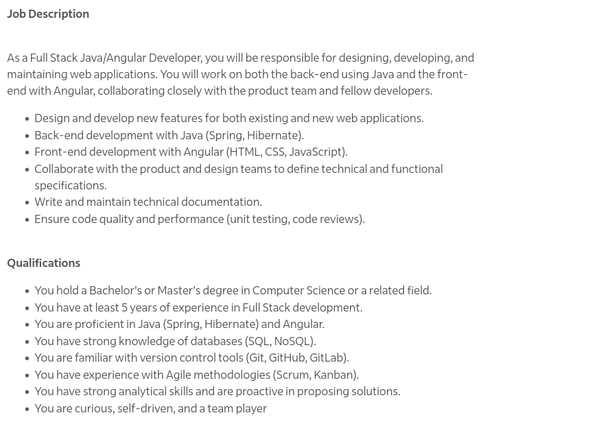

  

   

## Zoom sur le vocabulaire

- HTML, CSS, Javascript, Java
- Environnements et outils :  Git
- Frameworks : Spring, Angular
- Réunis les compétences **Frontend** et **Backend**

    

   

> https://emplois.be.indeed.com/viewjob?jk=150c6770ca97c97d&from=shareddesktop_copy consulté le 27/09/2025

<!--
Nous venons de voir deux métiers que recouvrent la tâche demandée à Alice. Mais la question se pose de savoir si Alice ne pourrait pas effectuer ce travail seule. Dans ce cas on dit qu'Alice est développeuse full stack.

Si on prend à nouveau l'exemple d'une offre d'emploi, on peut retrouver le même type de compétences. Les languages et technonolgies mentionnent cette fois de l'HTML et du CSS, pour la partie frontend, et du C# ou du python pour la partie backend. 

Un dev fullstack est un dev qui réunit les compétences front et back.

Dans cette offre on voit égualement de nouvelles mentions. La première est Bootstrap. Si il existe des frameworks pour les languages, il en existe pour le css. 

La seconde mention importante est Git.
Alice va écrire du code en javascript durant sa tâche. Mais ce code doit bien être sauvegardé quelque part. Si il est uniquement sur son ordinateur et que son ordinateur tombe en panne, comment va-t-on récupérer son travail ?
Une solution est de demander à Alice de déposer son travail sur un serveur de gestion de version. En gtos une autre machine surlaquelle l'historique de son travail est sauvegardé. La manière d'utiliser ce type de serveur est enseignée à l'ESI. C'est un inconrtounable lorsqu'on est dev.

-->

--- 
# Le quotidien d'Alice

  

   

## Développement

- Outils privilégiés : IDE, terminal
- Concevoir
- Développer
- Tester
- Intégrer

## Réunions
- Collègues : analystes, utilisateur·trices, développeur·euses
- Présentation des applications 

    

   

<!--
Après avoir vu les compétences attendues pour un développeur, on peut se demander à quoi ressemble une journée type d'Alice.

Son quotidien est divisé en deux types d'interractions. Elle va essentiellement travailler sur son ordinateur pour progammer le logiciel demandé. Les outils qu'elle ouvrira tous les jours son un IDe et un terminal <montrer vscode et un terminal>. Avec ces outils elle va développer, d'où son emploi. Mais développer ne veut pas simplement dire coder. Il va falloir concevoir, c'est réfléchir à comment on va organiser le code, comment le diviser en partie, tester son code et enfin l'intégrer. L'intégration consiste à mettre son travail en commun avec celui des autres. C'est une compétence que vous pratiquerez lorsque vous réaliserez des projets de développement à l'ESI.

Le second type d'interraction est résumé sur le slide par "Réunions". En fait le travail de développeur est avant tout un travail d'équipe. Pour démarrer son travail, Alice a reçu une demande d'un utilisateur. Cet utilisateur est un membre de l'équipe d'Alice. Elle doit travailler quotidiemment avec lui, pour lui poser des questions sut ce que doit faire le logiciel ou pour lui montrer l'état d'avancement. Ensuite Alice sera rarement seule à développer. On divise un logiciel en plusieurs parties afin de travailler en parrallèle. Elle aura des réunions avec des utilisateurs et des développeurs. Et aussi des analystes. Détaillons un peu ce qu'est un analyste.
-->

---        
     
# Analyste métier, fonctionnel, développeur,...

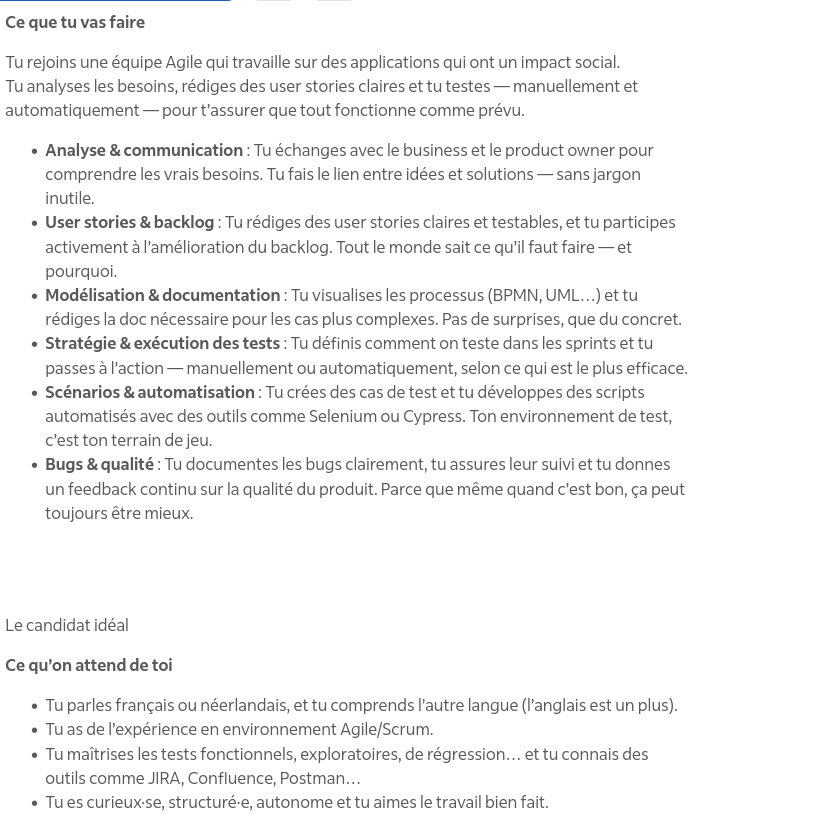

  

   

## Zoom sur le vocabulaire
- Faire une analyse business des processus afin de pouvoir faire une analyse fonctionnelle
- Tester les applications avec **Selunium** ou **Cypress**
- Responsable de la documentation 
- Connaissance en UML et BPMN
- Méthodologie Agile (SCRUM et KANBAN).
- Outils de gestion comme Jira ou Confluence

    

   

> https://emplois.be.indeed.com/viewjob?jk=b99c00c64b53f225&from=shareddesktop_copy consulté le 27/09/2025

<!--
Pour détailler ce métier, on va partir d'une offre d'emploi d'analyse fonctionnel. 
-->

---        
# Analyste

### Compétences techniques/Technicals skills
- Analyse des besoins : UML, BPMN
- SQL

### Compétences générales/Soft Skills
 - Communication
 - Gestion de projet
 - Planification

### Unités d'enseignement
 - IHM[X]
 - PRJ[X]

 > Programme : https://he2b.be/wp-content/uploads/2024/04/DEV-2024.pdf

---        
# Au delà du développement web

            

 

## Familles d'applications

- Applications web
- Applications mobiles
- Applications de bureau
- Applications embarquées

 
## Métiers

- **Analyste programmeur·se**
- Administrateur·trice de base de données
- Architecte
- Testeur·se
- Intégrateur·se
- Consultant·e
- ...
 

> Descriptions des métiers : https://metiers.siep.be/metier/analyste-programmeur-analyste-programmeuse/

---
<!-- _class: cite -->        

"L'**analyste-programmeur** est à la fois un traducteur, un interprète et un créateur. Selon l'expression consacrée, il **assure l'interface entre les besoins de l'utilisateur et les capacités de la machine**, via un logiciel ou un progiciel."

---
<!-- _class: cite -->        

"Il procède à une analyse préalable des **besoins** du client, à la conception du programme (**structure des données** et **algorithmes** des traitements), à la traduction en langage informatique des structures de données et algorithmes, aux **tests** de l'application. Il prend en charge la **maintenance**."

---        

# Sondage
 

            

<!-- _class: cool-list -->

1. *Allez sur wooclap.com*
1. *Entrez le code d'événement dans le bandeau supérieur **CLGMPC***

  

 ---
# De l'ordinateur local au partage d'une application
 

            

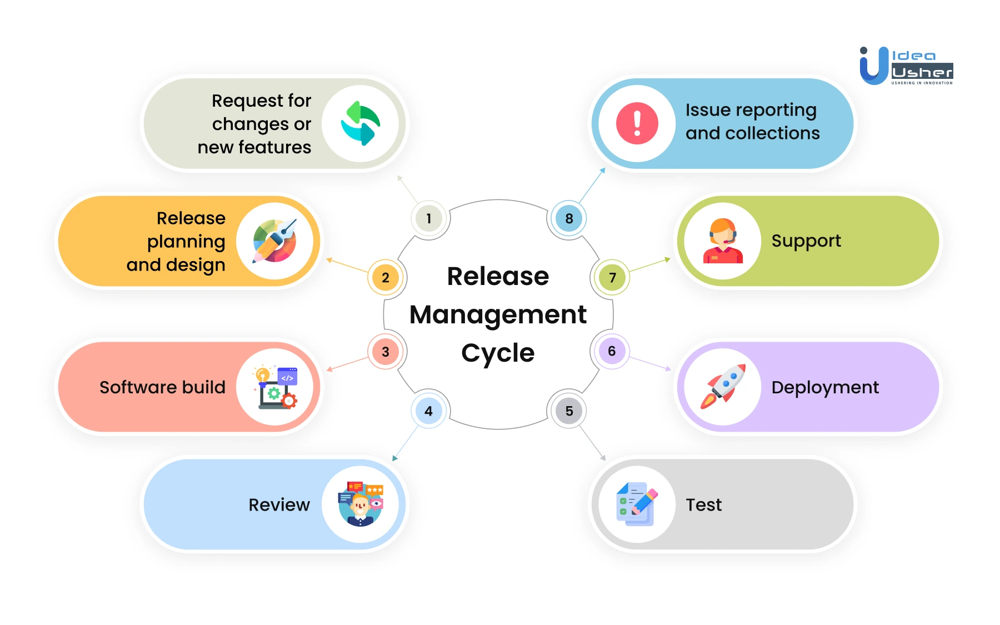

  

## Services à disposition
 - Serveur web
 - Serveur de base de données
 - Gestion des sources
 - Environnements de test
 - Environnements de production
 - Sécurité et accèssibilité
 - Gestionnaire de tickets 

<!--
-->

---        
# Gestion d'une application

            

 

## Tâches

 - Maintenance corrective et applicative
 - Support aux utilisateurs
 - Déploiement et gestion des serveurs
 - Sécurité et gestion des accès

 
## Métiers

- Application Support Engineer
- Release officer/manager
- Administrateur cybersécurité

**Unités** : SEC[X] DEV[X] PRJ[X] EXP[X]

---        
# La consultance en informatique

            

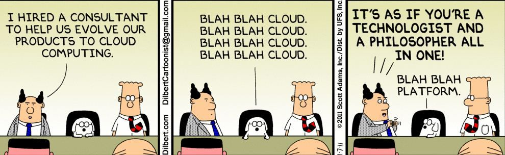

 

 

- Expertise technique
- Compétences en gestion de projet
- Compétences en communication
- Analyse et résolution de problèmes
- Adaptabilité et apprentissage continu
 

<!--

Mettre en fin de présentation métier, après Iot
- Définir la consultance
- Notion d'indépendant ou de société de consultance

Le rôle du consultant informatique consiste à fournir des conseils, une expertise et des solutions technologiques à des clients, entreprises ou organisations. Ils analysent les besoins spécifiques en informatique, identifient des problèmes, proposent des solutions sur mesure et les mettent en œuvre pour améliorer l'efficacité opérationnelle, la productivité et la résolution de problèmes informatiques. Les consultants informatiques travaillent généralement sur une variété de projets, de la gestion de projet à la mise en place de nouvelles technologies, tout en assurant une communication efficace avec leurs clients pour garantir la satisfaction et le succès du projet.

-->

 ---         
<!-- _class: transition2 -->  

 Seconde partie   **Réseaux et télécommunications**

 ---
# Administration et gestion réseau

### Bob se voit confier des responsabilités liées à la gestion des réseaux

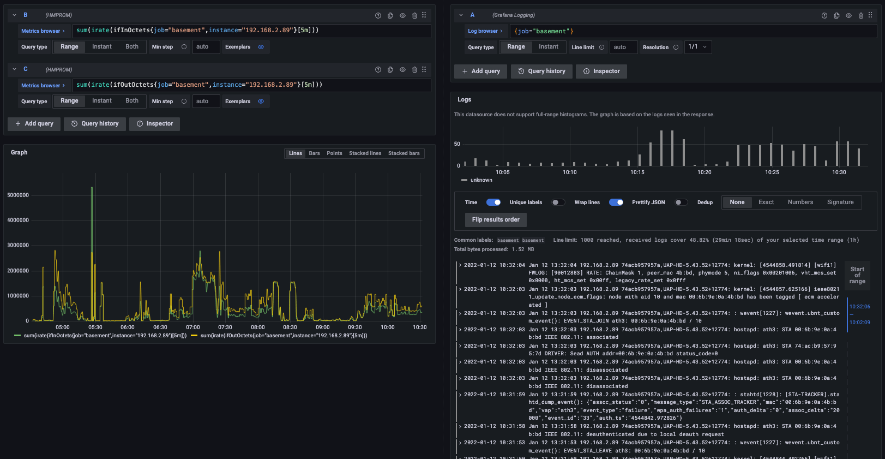

<figcaption align="center">
<b>Figure</b>: Monitoring réseau via Prometheus et Grafana
</figcaption>

### Demandes des utilisateurs
 
- **Monitoring réseau** : Les utilisateurs souhaitent que les connexions réseau du cinéma soient fiables pour le streaming vidéo en temps réel lors des projections.

- **VoIP** : assure la disponibilité et la qualité des communications vocales sur IP en configurant et en surveillant les équipements VoIP 

---
# Administration et gestion réseau

### Bob se voit confier des responsabilités liées à la gestion des réseaux

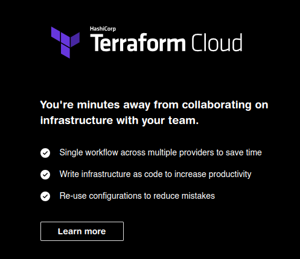

<figcaption align="center">
<b>Figure</b>: Terraform et IAC
</figcaption>

### Demandes des utilisateurs

- **Gestion des VLANs** : organise les équipements et les utilisateurs en groupes logiques, séparant ainsi le trafic réseau pour des raisons de sécurité, de performances ou de gestion.

- **Support** :  mettre en œuvre un plan de sauvegarde des données et un plan de reprise d'activité en cas de panne majeure du réseau

<!--
Bob se voit confier des responsabilités liées à la gestion des réseaux de l'entreprise cinématographique. Le réseau du cinéma diffuse plusieurs flux (vidéos, voix et données).

Bob veille à ce que les connexions réseau du cinéma soient fiables pour le streaming vidéo en temps réel lors des projections. Il utilise pour ce faire des outils comme Prometheus et Grafana  : https://grafana.com/blog/2022/01/19/a-beginners-guide-to-network-monitoring-with-grafana-and-prometheus/

Dans un second temps Bob est chargé de la configuration et de la gestion des VLANs sur les commutateurs réseau. Il organise les équipements et les utilisateurs en groupes logiques, séparant ainsi le trafic réseau pour des raisons de sécurité, de performances ou de gestion. Il veille à ce que les VLANs soient correctement configurés pour répondre aux besoins spécifiques de chaque groupe d'utilisateurs, par exemple, en séparant les VLANs pour les employés administratifs et ceux pour les invités du cinéma. Bob s'assure également que les règles de routage entre les VLANs sont correctement définies pour permettre la communication lorsque nécessaire. Cette tâche est cruciale pour maintenir l'efficacité et la sécurité du réseau de l'entreprise.

Finalement Bob est chargé de la gestion des services VoIP de l'entreprise. Il assure la disponibilité et la qualité des communications vocales sur IP en configurant et en surveillant les équipements VoIP tels que les serveurs SIP, les passerelles et les téléphones IP. Il s'assure que les appels vocaux sont acheminés efficacement sur le réseau IP de l'entreprise, en veillant à ce que la bande passante soit suffisante pour garantir des appels de haute qualité. En cas de problèmes de qualité des appels ou de défaillance du service VoIP, Bob diagnostique et résout les problèmes rapidement pour minimiser les perturbations dans les communications vocales de l'entreprise. Cette tâche est essentielle pour maintenir une communication fluide au sein de l'entreprise et avec les clients.

Bob a également des tâches de support. Bob élaborer et mettre en œuvre un plan de sauvegarde des données et un plan de reprise d'activité en cas de panne majeure du réseau. Fournir un support technique pour les employés en cas de problèmes liés au réseau, notamment la résolution des problèmes de connectivité ou de performance.
-->

--- 
  
<!-- _class: cite -->
 

"**Infrastructure as code** est un ensemble de mécanismes permettant de gérer, par des fichiers descripteurs ou des **scripts**, une infrastructure **virtuelle**. L'évolution des offres dans le domaine de la virtualisation a rendu possible la gestion d'une infrastructure à part entière incluant entre autres la gestion du service **DNS**, du **Load-Balancing**, des **sous-réseaux** et des **groupes de sécurité**. Elle offre aux développeurs la possibilité d'**automatiser leurs déploiements**. "

---
# Ingénieur réseau

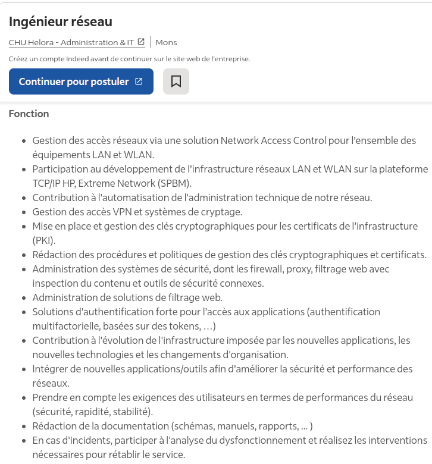

  

   

## Zoom sur le vocabulaire

- LAN et WLAN
- Gestion des réseaux TCP/IP, Voix sur IP, QoS, VPN, SNMP, DHCP, DNS, SSL VPN, routing et switching.
- Gestion des clés cryprtographiques et certificats
- Intégration d'applications
- Exigences des utilisateurs

    

   

> https://emplois.be.indeed.com/jobs?q=ing%C3%A9nieur+syst%C3%A8me&l=&from=searchOnDesktopSerp&vjk=495aefa39e031a2e consulté le 19/09/24

---
# Cloud architect

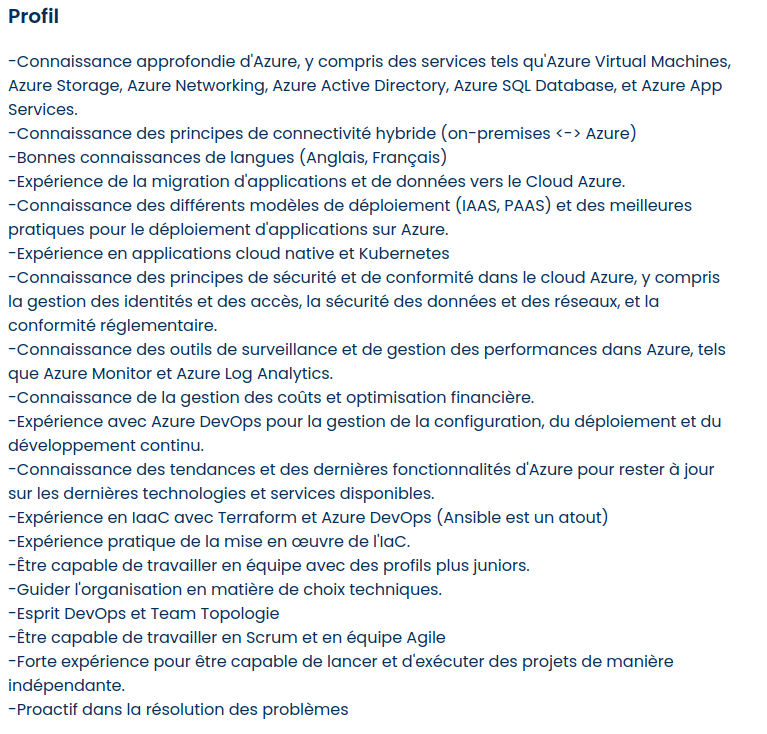

  

   

## Zoom sur le vocabulaire

- Outil tel que Microsoft Azure
- Connectivité hybride (on-premises Vs Azure)
- Migration d'applications et de données 
- Kubernetes
- Sécurité des données et des réseaux
- Outils de surveillance et de gestion des performances

    

   

> https://www.actiris.brussels/fr/citoyens/detail-offre-d-emploi/?reference=3913253&type=DirectOnline consulté le 12/09/23

---
# Les métiers liés au réseau
<!-- _class: cool-list -->

1. *Administrateur réseaux*
2. *Architecte réseaux*
2. *Administrateur système*
3. *Cloud Architect*
3. *Release officer/manager*

> https://metiers.siep.be/metier/architecte-reseaux/

---
<!-- _class: cite -->        

"L'architecte réseaux conçoit les composantes d'un réseau adapté aux besoins de l'entreprise. Cela consiste à d'abord définir les **besoins** d'échanges entre les différents acteurs et ensuite à déterminer les choix de **matériels** et de **logiciels** pour répondre au mieux à la demande. Après ces tâches, il mettra en place le réseau qui permettra aux utilisateurs d'échanger des informations d'un ordinateur à l'autre et prendra les mesures nécessaires pour la **sécurité** des accès et des communications."

---        
# Métiers du réseau : Compétences et parcours étudiants

### Compétences techniques/Technical skills
- Matériel : Cisco, Juniper,...
- Infrastructure as Code
- Cloud computing

### Compétences générales/Soft Skills
 - Communication
 - Gestion de projet
 - Planification

### Unités d'enseignement
 - TRE[X]
 - WAN[X]
 - AGW[X]
 - AGL[X]
 - EXP[X]
 - DOP1[X]
 - HYP[X]
 - DEV[X]

 > Note : https://he2b.be/wp-content/uploads/2024/04/RESEAUX-2024.pdf

 
<!--

-->

--- 
# Le quotidien de Bob

  

   

## Gestion de l'infrastructure

- Outils priviligiés : terminal, logiciel de monitoring
- Concevoir, configurer, scripter
- Tester

## Réunions
- Collègues : architectes, utilisateur·trices, développeur·euses
- Présentation des outils, des performances 

    

  

> Note : https://metiers.siep.be/metier/architecte-reseaux/
<!--

-->

 ---        
      
# Sondage
 

            

<!-- _class: cool-list -->

1. *Allez sur wooclap.com*
1. *Entrez le code d'événement dans le bandeau supérieur **EQXXZO***

  

<!--
Lancer un QCM avec des questions comme : 

- Quel est le rôle principal d'un développeur d'application ?
- Quelles compétences sont essentielles pour réussir en tant que développeur d'application ?
- Pourquoi la compréhension des besoins des utilisateurs est-elle cruciale pour un développeur d'application ?
- Parmi les options suivantes, laquelle est un métier lié au support informatique 
- Quelles sont les compétences nécessaires pour réussir en tant que consultant en support applicatif ?
- [mise en place pour les slides de la suite de la présentation]: Quelles sont les opportunités d'évolution de carrière pour les professionnels du support informatique ?
-->

 ---         
<!-- _class: transition2 -->  

 Troisième partie   **Informatique industrielle**

 ---
# Vers le cinéma 4D avec des IoT

### Carole est engagée comme Gestionnaire IoT

<figcaption align="center">
<b>Figure</b>: Arduino et Rasberry Pi
</figcaption>

### Demandes des utilisateurs

- **Installation de matériel** : rendre les salles de cinéma plus intelligentes en utilisant des systèmes IoT : 
   - gérer les lumières, la température et les sièges en temps réel
   - créer une expérience sonore immersive en ajustant le son en fonction de la disposition des spectateurs
   - surveiller et optimiser la consommation d'énergie

<!--
Les gestionnaires du cinéma souhaitent rendre les salles de cinéma plus intelligentes en utilisant des systèmes IoT. Carol est engagée comme Gestionnaire IoT. Plusieurs tâches lui sont assignées : 

- gérer les lumières, la température et les sièges en temps réel doit créer une ambiance personnalisée pour chaque projection
- créer une expérience sonore immersive en ajustant automatiquement le son en fonction de la disposition des spectateurs dans la salle
- surveiller et optimiser la consommation d'énergie, en éteignant automatiquement les lumières et le chauffage dans les salles vides

- surveiller la sécurité des cinémas, détecter les problèmes techniques et planifier la maintenance préventive

- optimiser la gestion des stocks de concessions (distributeurs), en alertant automatiquement lorsque les produits sont épuisés ou en planifiant les livraisons

-

- Embedded Software Engineer : https://www.ictjob.be/fr/emploi/vivid-resourcing-embedded-software-engineer/1-211073
-->

 ---
# IoT Fleet Manager

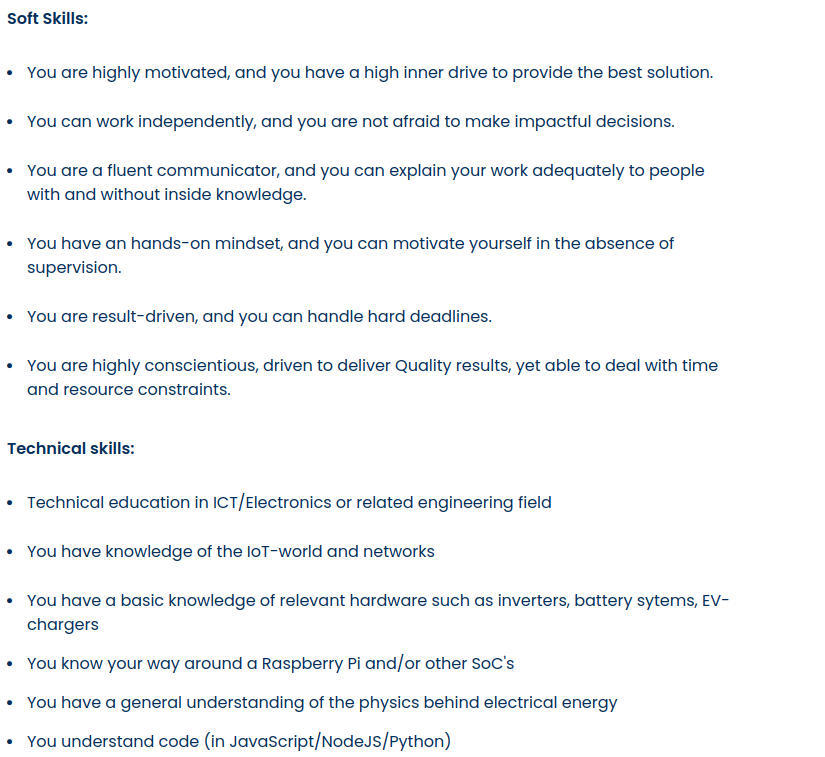

  

   

## Zoom sur le vocabulaire

- Connaissance en éléctronique et en ingénierie
- Iot et réseaux
- Raspberry Pi et autre **system on a chip** (SoC)
- Physique et électricité
- Language JavaScript/NodeJS/Python

    

   

> https://www.actiris.brussels/fr/citoyens/detail-offre-d-emploi/?reference=3930360&type=Hrxml consulté le 12/09/23

---
# Les métiers liés à l'informatique industrielle
<!-- _class: cool-list -->

1. *Gestionnaire iot*
2. *Embedded software engineer/Développeur système embarqué*
2. *Automation engineer/Automaticien*
2. *Robotics engineer/Ingénieur en robotique*
2. *Administrateur système*

> https://metiers.siep.be/metier/informaticien-industriel-informaticienne-industrielle/

---
<!-- _class: cite -->        

"L'informaticien industriel programme et supervise en temps réel le fonctionnement de dispositifs (**robots**, **chaînes d'assemblage automatisées** sur les lignes de production, industriels, **scientifiques**, **médicaux**, etc.). Cet expert maîtrise l'ensemble des techniques informatiques utilisées dans le monde industriel et les systèmes informatiques (**réseaux**, **interfaces**). "

---
<!-- _class: cite -->   

"Il participe à la conception des **logiciels de commande**, destinés, par exemples, au **pilotage** de machines automatisées pour l'assemblage de téléviseurs, aux lignes de produits agroalimentaires ou encore aux robots sur un site de fabrication d'automobiles. Il se charge aussi de leur **installation**, effectue les **tests** préalables à leur mise en service puis en assure la **maintenance**."

---        
# Métiers de l'informatique industrielle : Compétences et parcours étudiants

### Compétences techniques/Technical skills
- Connaissance en électronique, 
- Développement pour systeme embarqué, IoT 
- Rasberry, arduino, microcontroleur
- Python, C++, assembleur, javascript

### Compétences générales/Soft Skills
 - Communication
 - Gestion de projet et planification

### Unités d'enseignement
 - PHA[X]
 - ROE[X]
 - ROI[X]
 - IOT[X] 
 - IMG[X]  
 - AAT[X]
 - AUT[X]
 - DEV[X]

 > Note : https://he2b.be/wp-content/uploads/2024/04/INDUS-2024.pdf

 
<!--

-->

--- 
# Le quotidien de Carole

  

   

## Gestion de l'infrastructure

- Outils privilégiés : Simulateur (ex : staubli)
- Concevoir, configurer, scripter
- Tester

## Réunions
- Collègues : ingénieur·es, utilisateur·trices, développeur·euses
- Montrer l'exécution des tâches automatisées

    

  

> Note : https://metiers.siep.be/metier/informaticien-industriel-informaticienne-industrielle/
<!--

-->

---        
     
# Quelques mots sur les salaires

  

   

- Stepstone indicateur : 
   - [Développeur.se](https://www.stepstone.be/emplois/d%c3%a9veloppeur-se?action=facet_selected%3bdisciplines%3bIT&q=D%c3%a9veloppeur%2fse&fdl=fr&fdl=en&di=IT)
   - [Administrateur-trice réseaux](https://www.stepstone.be/salaire/Administrateur-trice-Systemes-et-Reseaux.html)
- Attention à l'effet de moyenne
- Différence entre salaire brut et salaire net
- Avantages extra-légaux

    

   

<!--
Pour détailler ce métier, on va partir d'une offre d'emploi d'analyse fonctionnel. 
-->

 ---
      
# Sondage
 

            

<!-- _class: cool-list -->

1. *Allez sur wooclap.com*
1. *Entrez le code d'événement dans le bandeau supérieur **NKRSZO***

  

      

<!--
- Demander d'introduire les noms de métiers qu'ils souhaitent qu'on aborde
- Soit on connaît la réponse et on montre une offre d'emploi liée, soit on expliquera lors de la présentation en fin de semestre
- Prévoir des exemples de métiers bonus au cas où le sondage n'est pas très rempli (prendre d'autres offres que celles-ci dessous)
  - data architect : https://www.actiris.brussels/fr/citoyens/detail-offre-d-emploi/?reference=3853308&type=Hrxml
  - solution architect : https://www.actiris.brussels/fr/citoyens/detail-offre-d-emploi/?reference=3689053&type=Hrxml
  - erp support manager : https://www.actiris.brussels/fr/citoyens/detail-offre-d-emploi/?reference=3518539&type=Hrxml

-->

 ---         
<!-- _class: transition2 -->  

---        
# La suite de INTM1

## Évaluation
 - Questionnaire
 - Interview à voir et lire
 - https://poesi.esi-bru.be/

---
# Résumé de la séance : associer formation-métier

## Formations      

<!-- _class: cool-list -->
1. *Développement d'applications*
2. *Réseaux et télécommunications*
3. *Informatique industrielle*

   

## Métiers

A. Analyste développeur 
B. Administrateur réseau 
C. Développeur·se système embarqué
D. Architecte application
E. Consultant ERP
F. Consultant réseau 
G. Développeur mobile 

    

 

---
# Résumé de la séance : associer compétences-métier

## Compétences      

<!-- _class: cool-list -->
1. *Résolution de problèmes*
2. *Communication*
3. *Gestion de projet*
4. *Développement*

   

## Métiers

A. Analyste développeur 
B. Administrateur réseau 
C. Développeur·se système embarqué
D. Architecte application
E. Consultant ERP
F. Consultant réseau 
G. Développeur mobile 

    

 

---   
<!-- _class: transition2 -->  

---        

<iframe allowfullscreen frameborder="0" height="100%" mozallowfullscreen style="min-width: 500px; min-height: 355px" src="https://app.wooclap.com/events/NKRSZO/results" width="100%"></iframe>

<!--
 - Afficher les noms de métiers encodés par les étudiants tout en répondant aux questions
-->

--- 

<!-- _class: biblio -->

# References 

1. “Informatique & télécommunication.” Métiers.be, https://metiers.siep.be/domaines/informatique-telecommunication/. Accessed 27 Sept. 2025.

